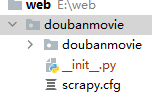
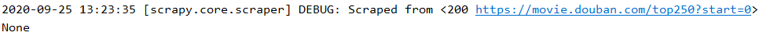
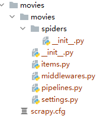
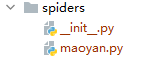

学习笔记

#### 作业说明
都是使用解析链接，然后跳转到具体详情页，再进行解析内容的。
1. 作业一：movies.py，生成文件为：movie.csv
2. 作业二：maoyan.py，生成文件为：movie2.csv


##### 补充
直接解析所给链接的隐藏内容。也给出了这种更方便的写法。
1. 作业一：another.py，生成文件为：movies_another.csv
2. 作业二：maoyan2.py，生成文件为：movie2_another.csv。
注：想要生成该文件，需要进入 pipelines.py 将里面存储文件字符串改为 movie2_another.csv。

xml 文件是测试使用，不用管他。

NOTE.md 是学习笔记，NOTE_files 是 md 文件图片。
***
***
#### `requests` 的用法
`requests` 用于发送 http 网络请求。
除了常用的读取相应内容 `get` 方法外，还有 `put`、'delete'、'head'、'option' 这四种方法。

`get` 的**必选**参数是 url。
若遇到网页有简单的**反爬虫**机制，我们需要添加 HTTP 头部，传递 dict 给 headers 参数就可以了。
```
>>> url = 'https://api.github.com/some/endpoint'
>>> headers = {'user-agent': 'my-app/0.0.1'}
>>> r = requests.get(url, headers=headers)
```
`user-aget` 大小写都可以，浏览器显示的是 `User-Agent`，从这上面可以取得相应值。
**注意**：`-` 必须是连字符，不能写成下划线。
***
***
#### `Beautiful Soup` 用法
Beautiful Soup 是一个可以从 HTML 或 XML 文件中提取数据的 Python 库。
```
from bs4 import BeautifulSoup
soup = BeautifulSoup(html_doc, 'html.parser')
```
`BeautiflulSoup` 的第一个参数是**字符串**或一个**文件句柄**。内容是 html 或 xml 类型的。
`html.parser` 是解析器，可选，除此以外还有 `lxml`，`xml`，`html5lib`。
优缺点如下表格：
<div class="wiz-table-container" style="position: relative; padding: 0px;" contenteditable="false"><div class="wiz-table-body" contenteditable="false"><table border="1" class="docutils" style="font-family: sans-serif; background-color: rgb(255, 255, 255); width: 736px;"><colgroup><col width="22%"><col width="26%"><col width="26%"><col width="26%"></colgroup><thead valign="bottom"><tr class="row-odd"><th class="head" style="background-color: rgb(238, 221, 238); width: 160px;">解析器</th><th class="head" style="background-color: rgb(238, 221, 238); width: 192px;">使用方法</th><th class="head" style="background-color: rgb(238, 221, 238); width: 192px;">优势</th><th class="head" style="background-color: rgb(238, 221, 238); width: 191px;">劣势</th></tr></thead><tbody valign="top"><tr class="row-even" style="height: 59px;"><td style="width: 160px;">Python标准库</td><td style="width: 192px;"><code class="docutils literal notranslate" style="background-color:rgb(236, 240, 243);font-size:0.95rem;"><span class="pre">BeautifulSoup(markup,</span><span>&nbsp;</span><span class="pre">"html.parser")</span></code></td><td style="width: 192px;"><ul class="first last simple"><li style="text-align:justify;">Python的内置标准库</li><li style="text-align:justify;">执行速度适中</li><li style="text-align:justify;">文档容错能力强</li></ul></td><td style="width: 191px;"><ul class="first last simple"><li style="text-align:justify;">Python 2.7.3 or 3.2.2)前 的版本中文档容错能力差</li></ul></td></tr><tr class="row-odd" style="height: 75px;"><td style="width: 160px;">lxml HTML 解析器</td><td style="width: 192px;"><code class="docutils literal notranslate" style="background-color:rgb(236, 240, 243);font-size:0.95rem;"><span class="pre">BeautifulSoup(markup,</span><span>&nbsp;</span><span class="pre">"lxml")</span></code></td><td style="width: 192px;"><ul class="first last simple"><li style="text-align:justify;">速度快</li><li style="text-align:justify;">文档容错能力强</li></ul></td><td style="width: 191px;"><ul class="first last simple"><li style="text-align:justify;">需要安装C语言库</li></ul></td></tr><tr class="row-even"><td style="width: 160px;">lxml XML 解析器</td><td style="width: 192px;"><p class="first" style="text-align:justify;"><code class="docutils literal notranslate" style="background-color:rgb(236, 240, 243);font-size:0.95rem;"><span class="pre">BeautifulSoup(markup,</span><span>&nbsp;</span><span class="pre">["lxml-xml"])</span></code></p><p class="last" style="text-align:justify;"><code class="docutils literal notranslate" style="background-color:rgb(236, 240, 243);font-size:0.95rem;"><span class="pre">BeautifulSoup(markup,</span><span>&nbsp;</span><span class="pre">"xml")</span></code></p></td><td style="width: 192px;"><ul class="first last simple"><li style="text-align:justify;">速度快</li><li style="text-align:justify;">唯一支持XML的解析器</li></ul></td><td style="width: 191px;"><ul class="first last simple"><li style="text-align:justify;">需要安装C语言库</li></ul></td></tr><tr class="row-odd" style="height: 118px;"><td style="width: 160px;">html5lib</td><td style="width: 192px;"><code class="docutils literal notranslate" style="background-color:rgb(236, 240, 243);font-size:0.95rem;"><span class="pre">BeautifulSoup(markup,</span><span>&nbsp;</span><span class="pre">"html5lib")</span></code></td><td style="width: 192px;"><ul class="first last simple"><li style="text-align:justify;">最好的容错性</li><li style="text-align:justify;">以浏览器的方式解析文档</li><li style="text-align:justify;">生成HTML5格式的文档</li></ul></td><td style="width: 191px;"><ul class="first last simple"><li style="text-align:justify;">速度慢</li><li style="text-align:justify;">不依赖外部扩展<br><div style="color:gray;"><br></div></li></ul></td></tr></tbody></table></div></div>
***
##### Beautiful Soup 对象用法
Beautiful Soup 可以将 HTML 转化 Python 对象，主要可以分为 4 类对象：`Tag`，`NavigableString`，`BeautifulSoup`，`Comment`。

`BeautifulSoup` 对象表示的是一个文档的全部内容，BeautifulSoup 初始化而来。我们大部分都可以当作 `Tag` 对象使用。

`NavigableString` 对象表示可遍历的字符串。是 `Tag` 对象的 string 属性。也是 str 的子类。平时当成字符串来使用，问题也不大。

`Comment` 对象不常用，表示注释内容，是一个特殊类型的 `NavigableString` 对象。

###### `Tag` 对象
Beautiful Soup 的**绝大多数方法或属性**都是针对 `Tag` 对象（可以理解为标签）的。
现在先介绍两个属性，其余方法或属性放的后面的遍历、搜索、打印中。（属性与方法的区别是后面是否带有括号，属性不带括号，方法要带括号）

`.name`：顾名思义，返回 `Tag` 对象的名字。例如：
```
>>> soup.b.name  # 先知道 soup.b 是一个 tag 类型即可，后面会解释的
'b'
```

`.attrs`：Attributes，属性。取标签的所有属性值，比如 `<b class="verybold" id='1'>Extremely bold</b>` 想取到 `verbold` 和 `id` 的值。
使用 `.attrs`，返回字典类型。
```
>>> soup.b.attrs
{'class': ['verybold'], 'id': '1'}
```
tag 的属性操作方法与**字典**一样。比如只要 `class` 的属性值：
```
>>> soup.b['class']
['verybold']
```
是的，你没有看错，并不需要取出所有 `attrs`，然后再选取 key。这种省略方式在 Beautiful Soup 里面很常见。
`class` 取出的是**列表**，`id` 取出的是**字符串**。这是因为 `class` 在 HTML 中可以定义更多属性，`id` 只能定义一个。尽管这里只定义了一个属性，但还是以列表返回了。

***
##### 搜索
就是在当前所在的节点（`Tag`），寻找指定的子节点（`Tag`）。这里子节点是**广义的**，不仅包括子节点，也包括所有**子孙节点**。
`find_all()` 以及 `find()` 方法是最常用的。前者返回列表，后者返回 `Tag` 类型，跟正则表达式 `re` 的同名方法还是挺像的。

###### `find_all()`
`find_all(name=None, attrs={}, recursive=True, text=None, limit=None, **kwargs)`：
可以根据标签名字，属性以及文本内容查找，返回列表。

标签属性可以通过关键字参数，也可以通过字典的方式传入，比如下面两个是相同的：
```
soup.find_all("a", attrs={"class": "sister"})
soup.find_all("a", class_="sister")
```
要注意：由于 class 在 Python 中是保留字，所以从 Beautiful Soup 的4.1.1版本开始，可以通过 `class_` 代替。下划线在后面，不要记错了。

文本内容也可以使用正则表达式。`limit` 限制返回个数。
`recursive` 表示是否递归搜索。默认是搜索当前节点的所以子孙节点。如果只想搜索 tag 的直接子节点,可以使用参数 `recursive=False`。

`find_all()` 可以简写：
```
soup.find_all("a")
soup("a")
```

若要搜索的节点相互嵌套，则会一一呈现：
```py
html = '''
<b class="verybold" id='1'>Extremely <b class='good'>bold</b></b>
<b>bold</b>
'''
soup = BeautifulSoup(html, 'html.parser')
print(soup.find_all('b'))
```

结果：`[<b class="verybold" id="1">Extremely <b class="good">bold</b></b>, <b class="good">bold</b>, <b>bold</b>]`

###### `find()`
`find(self, name=None, attrs={}, recursive=True, text=None,**kwargs)`：
与 `find_all()` 方法唯一的不同是只得到第一个结果，返回 `Tag` 类型。相当于 `limit=1` 的 `find_all()`。

`find()` 同样有简写：
```
soup.find('a')
soup.a
```
该简写用的还比较多，要记住是取**第一个**搜索到的**后代**节点，而不一定是直接子节点。
***
##### 遍历
搜索是可以跳转的，而遍历是层层刨析的那种。
遍历当然可以用 `find()` 和 `find_all()` 方法，更多时候还是要用到前者（的简写）。

这里只说我用到的一种属性。
一个 `Tag` 可能包含多个**字符串**或其它的 `Tag`，这些都是这个 `Tag` 的子节点。在此说明，前面提到的字节都是特指 `Tag` 节点。

tag 的 `.contents` 属性可以将 tag 的子节点以**列表**的方式输出。
比如：
```xml
<div class="movie-hover-title" title="我的女友是机器人">
    <span class="hover-tag">类型:</span>
    爱情／喜剧
</div>
```
使用 `soup.div.contents` 打印出来：`['\n', <span class="hover-tag">类型:</span>, '\n爱情／喜剧\n']`。
里面既有 `str`，也有 `Tag`。
***
##### 打印
我们输出所要的结果有多种方式：
* 若只需要文本内容（不含标签）：`Tag.text` 或 `Tag.get_text()`。
* 还可以直接打印 `Tag`：直接输出 `Tag` 或美化版本 `div.prettify()`（有错落格式的那种）。
* 若你知道该 `Tag` 里面不含其他 `Tag`，只有文本内容：`Tag.string`，否则会输出 `None`。
* 也有 `Tag.strings` 属性，这东西输出的是由文本内容构成的**生成器*，需要循环打印出来。

***
***
#### scrapy 和 xpath
下次再写，留个坑……


限制域名

yield 返回的是生成器类型


doubanmovie 下面也要新建一个 __init__.py 文件才能将**子目录**也转化为包，上面多一个小白圆。


启动：
scrapy crawl douban

一定要配置 items
***

items 文件里面一定要有 `return item` 才能正确地抓取到结果。
否则：



***
1. 建爬虫项目：`scrapy startproject movies`。
movies 项目文件加里面会有一个同名的 movies 子目录和配置文件 scrpy.cfg。

2. 进入到 movies/movies/spiders 目录，然后运行 `scrapy genspider maoyan maoyan.com`。
 第一个 maoyan 是文件的名字，第二个是域名，两个可以不一样。运行时要找文件名字。



进入 seting.py：
* 去掉 17 行注释，配置用户代理。
* 28 行改为 1，延迟 1s。
* 去掉 66-68 行注释，配置 item pipelines。


