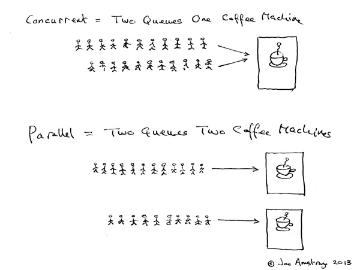
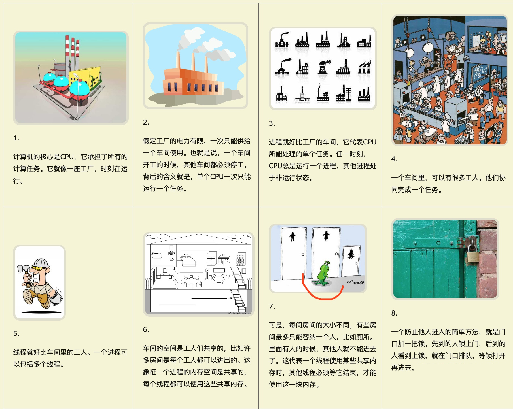

学习笔记

### 作业说明

作业一用了两种方法：
1. 1.1DiningPhilosophers.py 使用条件变量。
2. 1.2DiningPhilosophers.py 使用信号量。

### 术语理解
#### 同步 Vs. 异步
同步和异步关注的是**消息通信机制**。
所谓同步，就是在发出一个调用时，在没有得到结果之前，**不能**进行下面的操作。
异步，就是在发出一个调用时，不管有没有得到结果，都**可以**进行下面的操作。

两个可以简单理解为做事情：
同步：一件事做完做另一件事。
异步：没做完也可以处理另外的事情。

#### 阻塞 Vs. 非阻塞
阻塞 / 非阻塞关注的是程序在**等待**调用结果（消息，返回值）时的状态。

阻塞是指调用结果返回之前，当前程序会被挂起，一直处于等待期间。调用程序只有在得到结果**之后才能**继续操作。
非阻塞是指调用无论什么时候返回结果，都**可以继续**进行下面的操作。

跟同步异步的概念还是比较相似。
它们最大的**不同**是：
* 阻塞和非阻塞是针对**发起方**。
* 同步与异步针对被**发起方**。

#### 并行 Vs. 并发
**并行**概念是**并发**概念的一个子集，并行比并发要求更苛刻一些：
并发：支持两个或者多个动作（Action）同时**存在**，但执行不一定同时进行。
并行：支持两个或者多个动作**同时执行**。

#### 进程 Vs. 线程
进程是执行在 cpu 上的，一个 cpu 核心只能执行一个进程。
而进程可以包含多个线程。

多线程往往是一个 cpu 核心的工作状态。
多线程在 **I/O 密集型**场景有很大优势。
线程抢占 GIL，待遇到 I/O 操作就释放掉，这时其他线程就可以抢占来执行。同时该线程继续执行 I/O 操作。
多线程在 Python 里面实际上是**伪多线程**，并非真正意义上的并行操作。

而多进程会涉及到多核调度，适用于**计算**等操作。



***
### 进程 `multiprocessing`
`multiprocessing` 模块允许程序员充分利用机器上的多个核心。
#### 基本操作
创建**子进程**：
```
p = Process(group=None, target=None, name=None, args=(), kwargs={}, *, daemon=None)
```
其中，将可调用函数对象赋值给 `target` ，`args` 的参数必须是元组类型。还可以给进程取名字。

运行进程：` p.start()`，本质是调用 `Process` 的 `run` 方法，其实也就是 `target` 指代的哪个函数。

各个进程的运行时间不同，有可能子进程还在运行，而父进程已经结束了。为了控制进程的先后顺序，可以使用：`p.join()` 。父进程要等子进程结束，实际上是对该子进程进行了**阻塞**，直到到该进程终止。

创建子进程还可以使用**类的继承**，但必须重写 `Process` 的 `run` 方法。

注意：执行进程的代码一定要写在 `if __name__ == '__main__'` 之内，否则会报错。

其他操作：
* 返回当前的子进程，以列表形式返回：`multiprocessing.active_children()`。
* 进程名字：`p.name`
* 进程 id 号：`p.pid`，本质是调用了 `os.getpid()`。父进程 id 号：`os.getppid()`
* 系统 cpu 核心数量：`multiprocessing.cpu_count())`，注意不是当前剩余的数量。可用的CPU数量可以由 len(os.sched_getaffinity(0)) 方法获得。

#### 进程通信
变量赋值实际上是在该进程里面的**堆栈**里，所以另外的进程是访问不到的。
我们可以使用**进程队列**、**管道**以及**共享内存**进行通信，由于后两者是更接近底层的 API，不常用，所以只介绍队列：`multiprocessing.Queue`。

Queue 类是一个近似 queue.Queue 的克隆。 除了 `task_done()` 和 `join()` 之外，Queue  实现了标准库类 queue.Queue 中所有的方法。这句话很重要。

定义队列：`q = Queue(maxsize=0)`，可以填队列长度，默认无穷大。

判空：`q.empty()`。判满：`q.full()`。判断队列此时的长度（元素的个数）： `q.qsize()`。

`put(obj[, block[, timeout]])`：放入元素，默认阻塞状态。
`obj`，必须参数。`block` 可选参数，默认为 True，等待。 `timeout` 默认是 `None`。
若 `block` 为 `False` 或超过了预设的 `timeout` **秒**，还是没有可用的缓冲槽，抛出 queue.Full  异常。

`get([block[, timeout]])`：取出元素，默认阻塞。没有必须参数，两个可选参数。与 `put` 差不多，只是没有可用的对象时抛出 queue.Empty 异常。

#### 锁对象
进程常用的锁主要有两种：原始锁 `multiprocessing.Lock`，递归锁 `multiprocessing.RLock`。
两者都支持**上下文环境**。

每种锁都有两种方法：
`acquire(block=True, timeout=None)`：默认阻塞地获得锁。
`release()`：释放锁。

`RLock` 可以进行嵌套，`Lock` 嵌套会造成死锁。
哪个进程选抢到锁，哪个进程执行。
#### 进程池
创建进程池对象：
```py
p = multiprocessing.pool.Pool([processes])
```
第一个可选参数是进程的工作数量。默认使用 `os.cpu_count()` 返回的值。

放进进程池里一个进程，并执行：
```py
p.apply_async(func, args=(), kwds={}, callback=None,error_callback=None)
```

`close()`：阻止后续任务提交到进程池，当所有任务执行完成后，工作进程会退出。
`terminate()`：不必等待未完成的任务，立即停止工作进程。
`join()`：等待工作进程结束。调用 `join()` 前必须先调用 `close()` 或者 `terminate()` 。

进程池也可以使用 with 上下文语句，但 `__enter__()` 返回进程池对象，`__exit__()` 会调用 `terminate()`。所以不会等待所有工作进程结束。要慎用。

map() 和 imap() 区别：回头再说。
***
### 线程 threading
有时间再说吧……


