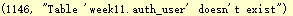
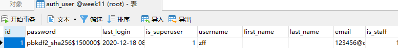
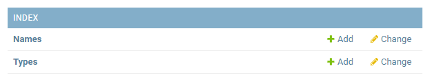
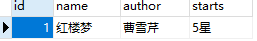

### 管理界面
要先在数据库中定义模型，否则打开 admin 进行登陆报错。

#### 创建一个管理员账号
首先，我们得创建一个能登录管理页面的用户。请运行下面的命令：
```
> py manage.py createsuperuser
```
键入你想要使用的用户名，邮件地址，最后一步是输入密码。
管理员账号：zff ，密码：zff789456
用户：bigfly， 密码：123456zff

结果会存入到 auth_user 表中，密码以加密后的显示。



对于用户有几种分类：
* is_superuser 和 is_staff 和 is_active 都为 1：超级用户，有所有权限
* is_staff 和 is_active 都为 1：后台管理用户
* 只有 is_active 为 1：只运行登陆前台
#### 在管理页面中加入数据模型
在 index 下面的 admin.py 注册模型：
```py
from django.contrib import admin
from .models import Type, Name

# Register your models here.
admin.site.register(Type)
admin.site.register(Name)
```
管理页面会显示：


可以通过网页直接写入数据库：


***
### 表单
使用 django 生成 HTML，然后写入校验的功能（在请求中间件做）。

view 传递的参数还可以是字典类型，比如 `return render(request, 'form2.html', {'form': login_form})`。
在 form2.html 中使用变量：`{{ form }}`。

view.py 视图，引用了表单 form.py，再 render 到 html 页面中去。

使用 Form 对象定义表单。form.py：
```py
from django import forms


class LoginForm(forms.Form):
    username = forms.CharField()
    password = forms.CharField(widget=forms.PasswordInput, min_length=6)
```
form.html：
```html
<!DOCTYPE html>
<html lang="en">
<head>
    <meta charset="UTF-8">
    <title>Title</title>
</head>
<body>
<p>Input your username and password</p>
<form action="/login", method="post">
    
    {{ form }}
    <input type="submit" value="login">
</form>
</body>
</html>
```
创建用户，可以通过（默认创建的是前台用户）：
python manage.py shell
命令行创建：
```
In [1]: from django.contrib.auth.models import User

In [3]: user = User.objects.create_user('tom', 'tom@tom.com', 'tompassword')   # 必须要有这 3 个字段

In [4]: user.save()  #  存储数据库

In [5]: from django.contrib.auth import authenticate

In [6]: user
Out[6]: <User: tom>

In [7]: authenticate(username='tom', password='tompassword')  # 验证成功
Out[7]: <User: tom>

In [8]: authenticate(username='tom', password='tompasswd')  # 验证失败，返回空
```
#### CSRF
CSRF：跨站请求攻击
给 post 页面加入 csrf_token 即可。

csrf 中间件只用作 post 请求。
`from django.views.decorators.csrf import csrf_exempt, csrf_protect`
两个装饰器分别表示：某一个不被保护，某一个被保护（中间件要注释掉，setting.py 中 MIDDLEWARE 的 csrf 要注释掉）。

对于 ajax 也要特别注意。
***
### 用户管理认证
### 信号
注册机制，回调函数
装饰器
### 中间件
全局过滤系统，更偏向于底层。
中间件处理顺序和在 setting.py 书写的顺序有关。
要进行反爬虫，中间件往往写在最前面。
*** 
### 生产环境部署

WGSI 用于模拟 Http。
Nginx：普遍
gunicorn：（green unicorn）更高性能，简单。防止原来的 runserver 启动，多用户访问会产生阻塞。

平时：
改 IP，改端口，改进程的数量，打印日志
***
### celery 介绍
定时任务，分布式消息队列

***
### Flask
只实现了最核心的功能：
1. WSGI 协议的一个实现
2. 集成了一个 Jinja 模板

同样采用了 MTV 模式。
### 底层框架
gevent：代码容易维护
twisted：稳定性最好
tornado：兼容性最好
