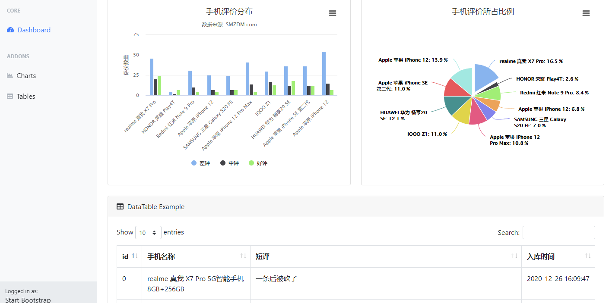

### 毕业项目说明
* 爬虫项目：product。
解析商品链接 --> 解析评论链接 --> 提取评论 --> 存入数据库。 
* 数据处理：sentiment.ipynb。
数据库：work，原来表：shorts，处理后的表：table1。
* Django 项目：myDjango。
index.html 包含了所有的显示部分。
模板和静态部分最关键的文件：index.html，bar.js，pie.js。其余相当于 index 的分部分。
view.py 主要函数是：def get_rates()，def get_counts()，def show(request)。
urls.py 需要留心 `re_path(r'^index', views.show)` 这个，其余的都是分页面跳转。


***
### 项目教训和收获
#### 爬虫部分
1. 抓取评论时，被反爬了，尝试使用随机代理，无果。
后来在终端上发现每次发起请求时，链接的后面总显示 `referer(None)`。
就在中间件添加了获取 referer 的函数，成功。
2. xpath 解析数据时，开头要么是直接以子元素，比如 `div`，要么加入当前节点 `./div`，这两个相同。
不能写成 `/div`，这表示从**根元素**选取，而不是从当前元素选取。
3. 爬虫时就不要**过分**遵守君子协议 robots.txt 了，这次就不讲武德了。
在 seting.py 中修改为 `ROBOTSTXT_OBEY = False`。
4. 发现爬取的评论总是少一页。
搜索提示 `[scrapy] DEBUG:Filtered duplicate request` 得知 scrapy 框架默认是有去重（重复的请求直接忽略掉）设置的。需要在后面的请求里面加参数 `dont_filter=True`：`request = scrapy.FormRequest(url=url, formdata=data_url, callback=self.get_parse,dont_filter=True)`。
5. 设置存入数据库的时间为 utc-time，便于国际化。
sql 语句： `insert into shorts(phone_name, short, storage_time) values (%s, %s, UTC_TIMESTAMP())`。
#### 数据处理部分
pandas 读取数据库，读取到空值，不是 `np.nan`，而是空字符串 `''`。
删除空行，不能直接使用 `df.dropna()`。而要先正则化处理：`df.replace(r'^\s*$', np.nan, regex=True)`。
#### Django 项目
1. 使用 highcharts 做为模板进行画图，可发现无论如何都无法使用 django 的变量。
原来是 html 页面中的 javascript 无法直接使用，需要将数据 json 化才可以使用。
所以在最后这样 `return render(request, 'index.html', {"counts": json.dumps(counts)})`。
在 html 中的 js 里面要 `var counts = {{ counts | safe }};` 定义使用。
2. 为了能在 js 中方便使用 djano 变量，这次数据类型都是完全符合模板要求的。
关于这点，我也是忙得焦头烂额才找到了上面做法。观看同学的代码，发现也可以在 js 中使用类似 `{{% }}` 的循环，等有时间再看看吧。
3. 观看同学的代码，发现都是使用的 bootstrap 做的，所以我索性又重新引入了 bootstrap 模板做了一遍。
4. 原想将 javascript 部分独立出来，却发现报错，无法定义 django 中的变量。
于是将定义放在了 html 页面，剩余部分独立出来：
```html
<script>var rates = {{ rates | safe }};</script>
<script src="../static/js/bar.js"></script>
```
***
#### Django 项目展示
首页链接（默认）：http://127.0.0.1:8000/index.html


其余都是部分内容的页面了，点击左边导航就行：

表格页：http://127.0.0.1:8000/tables.html
图表页：http://127.0.0.1:8000/tables.html

另外原来的也没删：
旧的主页：http://127.0.0.1:8000/index2
饼状图：http://127.0.0.1:8000/pie
柱状图：http://127.0.0.1:8000/bar

***
### 说点心里话
终于结束了。在连续几天的高强度任务中，终于把最后项目完成了。当初还想着，今天要是做不完，就直接通宵完成吧。可能我低估了自己，今晚就完成了。不用再通宵了，不用再肝了。项目要说有什么遗憾，那就是定时任务直接没做，当初就没怎么听懂实践。

我是眼看着每次提交作业的人在变少，从最初的 40 人到 30 人，20 人……真的坚持的人越来越少了。我为什么坚持呢？最主要还是交了钱，不物尽其用真得浪费了，再有就是以后就靠 python 吃饭了，这都完成不了自己也说不过去。

刚开始信心满满的学，后来为了完成作业而学，在最想放弃的时候没能放弃，不求更多，我觉得够了。我已经好多次周末没有休息过了，谁让 DDL（deadline） 就在周一呢？这也算是好事一件吧。

最后，祝老师，助教，助班以及极客时间的工作人员，还有所有看到这里的人都能开开心心发大财。

有缘再会！
